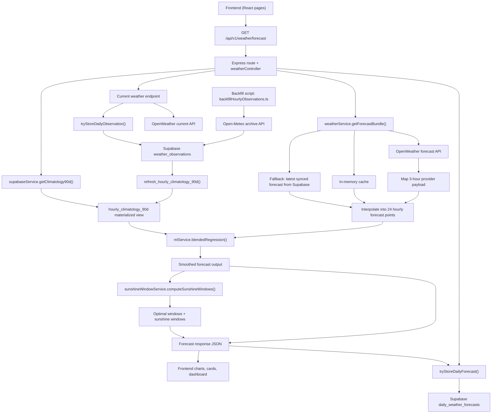

# Data Pipeline Visualization

This project does not train a large machine learning model in the traditional sense.
Instead, it uses a lightweight forecast pipeline:

- live forecast data from OpenWeather
- historical hourly observations stored in Supabase
- a rolling 90-day climatology baseline
- polynomial regression and climatology-residual blending

The diagram below shows how data moves from fetch, to historical preparation, to prediction output.

## Step-by-Step Flow

1. The frontend calls `/api/v1/weather/forecast`.
2. The backend fetches live forecast data from OpenWeather, using cache and fallback logic.
3. The raw provider data is mapped and interpolated into 24 hourly forecast points.
4. Historical hourly observations are collected separately through the backfill script and stored in Supabase.
5. Supabase refreshes `hourly_climatology_90d`, which acts as the historical baseline for each hour of day.
6. `blendedRegression()` combines the live forecast with the climatology baseline:
   - if climatology is unavailable, it falls back to polynomial smoothing only
   - if climatology is available, it fits residual curves and blends them back into the hourly averages
7. The backend computes sunshine windows and optimal activity windows from the smoothed forecast.
8. The final JSON response is returned to the frontend for charts, KPIs, and weather recommendations.
9. The forecast snapshot is also saved to Supabase so it can be reused during provider outages.

## Practical Interpretation

- "Fetch" comes from OpenWeather for live inference and Open-Meteo Archive for historical backfill.
- "Train" in this setup means building the rolling hourly climatology baseline from stored observations.
- "Output" is the smoothed forecast plus sunshine/optimal windows returned by the API and rendered in the UI.
